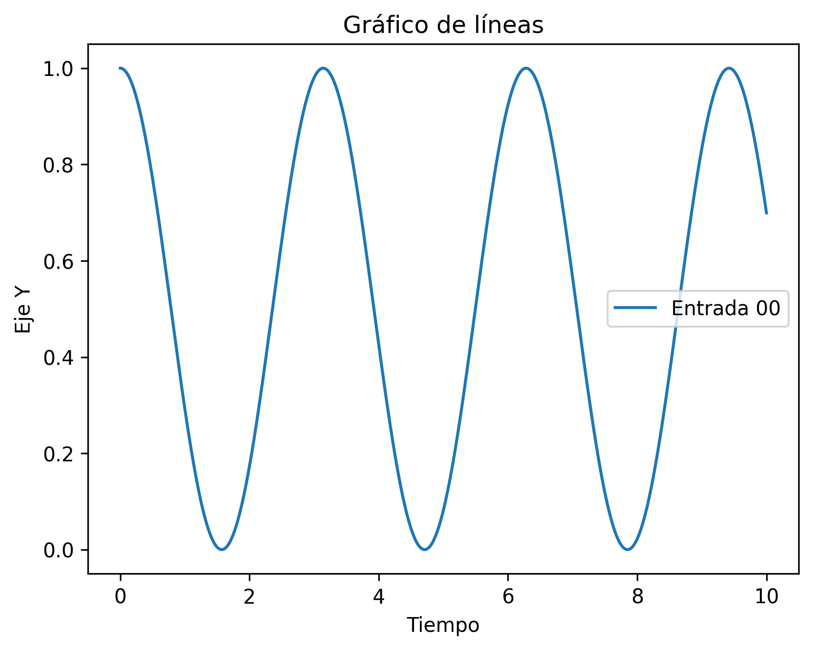
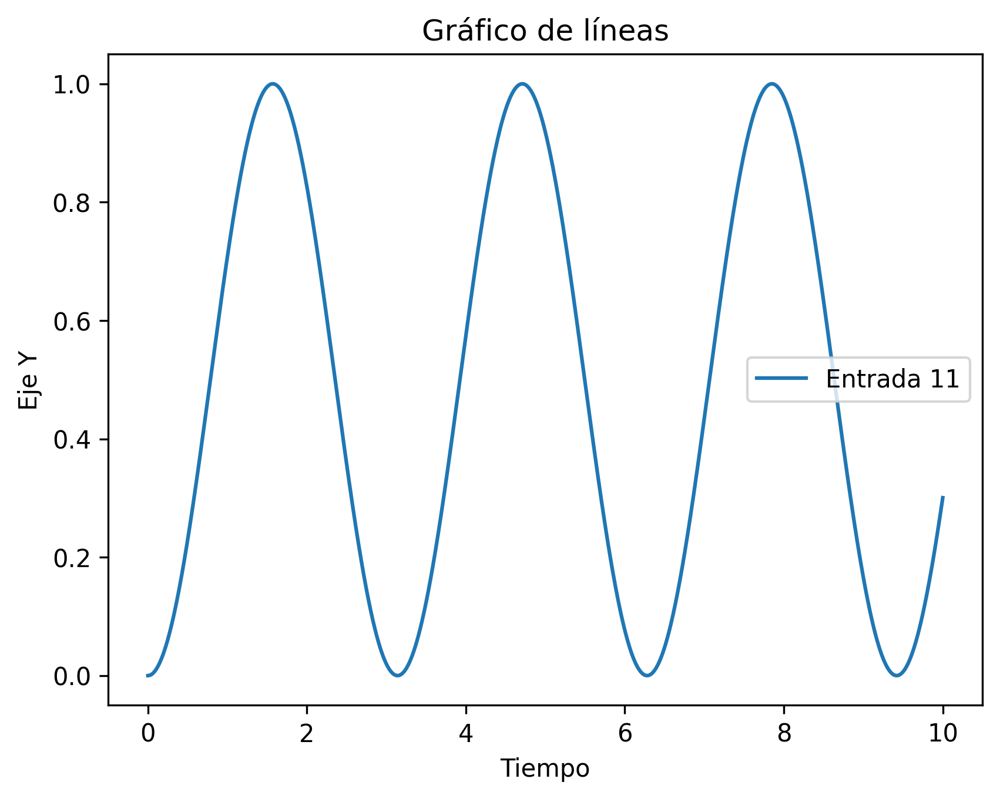

# Ejemplo de uso de las funciones

Se quiere estudiar la evolución temporal de un estado y(t). Este estado será representado mediante una matriz 2x2 que corresponde a algún operador lineal. La función que genera la dinámica del problema es
$$
f(t, \mathbf{y}) = -{\rm{i}} [\mathbf{O}, \mathbf{y}(t)],
$$
donde **O** es otro operador lineal, i es la constante compleja y [A, B] = AB - BA es un operación de conmutación. **La función no depende explícitamente de la variable temporal**.

Este es un ejemplo de cómo utilizar las funciones implementadas:

```python

    import funciones.py
    import matplotlib.pyplot as plt
    import numpy as np
    iConst = 1.0j
    
    #Se define el operador O y el estado inicial:
    oOper = np.array([[0, 1], [1, 0]])
    yInit = np.array([[1, 0], [0, 0]])
    
    #Se define la variable que contiene el arreglo de valores temporales y la que
    contiene el paso temporal:
    times = np.linspace(0.0, 10.0, 10001)
    h = times[1] - times[0]
    
    #Se inicializan dos arreglos que van a contener los valores con valores iniciales
    cero. Se usa el mismo tamaño del arreglo que contiene la variable independiente
    temporal:
    stateQuant00 = np.zeros(times.size)
    stateQuant11 = np.zeros(times.size)
    
    #Se llama de manera iterativa la rutina rk4(), calculando el operador
    del estado del sistema y(t) a traves del tiempo. Las entradas (0,0) y (1,1) se
    iran guardando con cada iteración.
    for tt in range(times.size):
    stateQuant00[tt] = yInit[0][0]
    stateQuant11[tt] = yInit[1][1]
    yN = funciones.rk4(funciones.dyn_generator, oOper, yInit, h)
    yInit = yN
    
    #Finalmente se grafican los valores en las entradas (0,0) y (1,1) a traves
    del tiempo:
    plt.plot(times, stateQuant00, label='Entrada 00')
    plt.title('Gráfico de líneas')
    plt.xlabel('Tiempo')
    plt.ylabel('Eje Y')
    plt.legend()
    plt.show()
    
    plt.plot(times, stateQuant11, label='Entrada 11')
    plt.title('Gráfico de líneas')
    plt.xlabel('Tiempo')
    plt.ylabel('Eje Y')
    plt.legend()
    plt.show()

```




